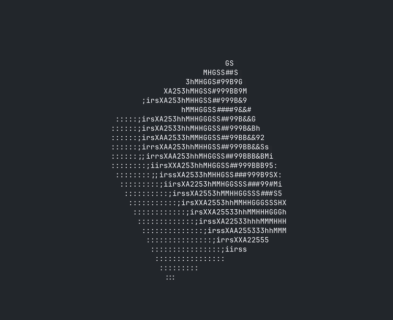

# TermRaster

<p align="center">
  
</p>

A software 3D renderer written from scratch in C that renders directly to the terminal using ASCII characters.

No OpenGL. No SDL. No graphics libraries.

## Current Features

* Perspective projection
* Dynamic mesh structures
* Cube and sphere generation
* Wireframe rendering
* Z-buffer
* Real-time terminal animation

## Roadmap

* Filled triangle rasterization
* Back-face culling
* Hidden surface removal
* Flat and smooth shading
* Perspective-correct interpolation
* OBJ mesh loading
* Camera controls
* Arbitrary mesh rendering

## Goal

Build a miniature software graphics pipeline from first principles and understand how modern renderers work under the hood.

## Build

```bash
make
```

## Run

```bash
make run
```

